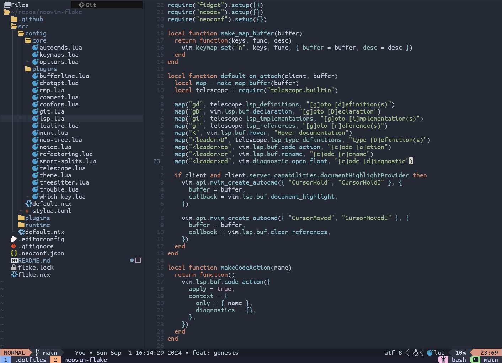

# neovim flake

<p align="center">
    
</p>

## Requirements

- [nix](https://nixos.org/download)

## Usage

```bash
nix run github:csvenke/neovim-flake
```

If you dont have flakes enabled

```bash
nix run --extra-experimental-features 'nix-command flakes' github:csvenke/neovim-flake
```
